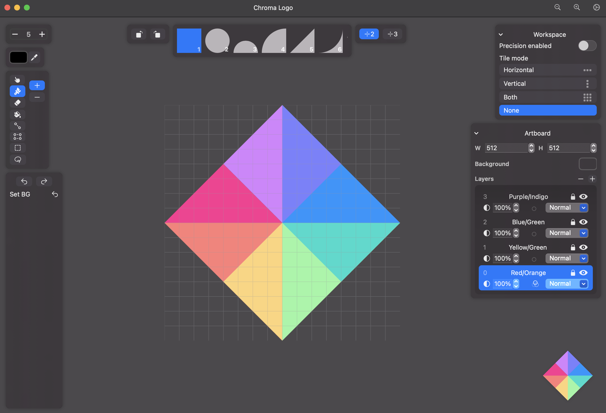

# 🎨 Chroma
### A vector design app, built natively for MacOS, iOS, and iPadOS

## Why Chroma?

Chroma was built specifically for logos, fonts, and other vector designs that value precision. 

This app works like pixel art – place "pixels" of any shape on a grid to create accurate and beautiful designs without worrying about measuring, alignment, etc.

## Features
- Built specifically for logos, fonts, and other precise designs
- Basic tools like draw, erase, fill, select, etc.
- Layers with opacity, blend modes, and effects like blur and drop shadow
- Photoshop-like history, undo, and redo, so you can try things out without committing
- Non-destructive erasing with positive and negative shapes
- See your designs tiled on multiple axes, great for creating seamless patterns
- Shortcuts for everything
- In-app documentation for advanced features and shortcuts
- Dark & light mode and other visual customization
- Export to SVG or PNG
- Saves to a `.Chroma` extension, but it's just JSON – you can edit it yourself in any text editor
- Built natively for Apple products in Swift, for great performance

## Tech
- Built using Swift & SwiftUI
- Open source

## Roadmap
See the [Github issues](https://github.com/audse/chroma/issues?q=is%3Aopen+is%3Aissue+label%3Afeature) to see what's coming soon.

Highlights include:
- [ ] Adjustment layers
- [ ] Save & load color palettes
- [ ] Persistent history
- [ ] Symmetry mode
- [ ] Import pixel shape
- [ ] Import SVG